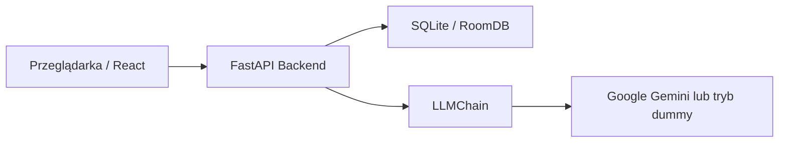

# AI-kinator

AI-kinator to webowa gra inspirowana Akinatorem, w której gracz lub wielu graczy próbuje odgadnąć sekretną postać, zadając pytania typu tak/nie do modelu językowego. Projekt łączy frontend w React, backend w FastAPI oraz warstwę AI opartą o LangChain i Google Gemini, a w razie braku klucza API potrafi działać także w trybie zastępczym.

Repozytorium zawiera finalną, działającą wersję aplikacji z obsługą gry solo, pojedynków 1v1, battle royale, kodów zaproszeń, lobby przed startem, historii rozmowy, zgadywania postaci i systemu podpowiedzi.

## Spis treści

1. [Najważniejsze funkcje](#najważniejsze-funkcje)
2. [Stack technologiczny](#stack-technologiczny)
3. [Architektura systemu](#architektura-systemu)
4. [Tryby gry](#tryby-gry)
5. [Przepływ rozgrywki](#przepływ-rozgrywki)
6. [Installation & Running](#installation--running)
7. [Konfiguracja środowiska](#konfiguracja-środowiska)
8. [API backendu](#api-backendu)
9. [Frontend](#frontend)
10. [Warstwa AI](#warstwa-ai)
11. [Baza danych i model stanu](#baza-danych-i-model-stanu)
12. [Testy](#testy)
13. [Struktura projektu](#struktura-projektu)
14. [Scenariusze użycia](#scenariusze-użycia)
15. [Rozwiązywanie problemów](#rozwiązywanie-problemów)
16. [Rozwój projektu](#rozwój-projektu)

## Najważniejsze funkcje

- Gra solo przeciwko AI.
- Tryb duel dla 2 graczy.
- Tryb battle royale dla wielu graczy.
- Tworzenie pokoju i dołączanie przez kod zaproszenia.
- Ekran oczekiwania z listą graczy i ręcznym startem gry.
- Polling stanu pokoju z poziomu frontendu.
- Historia rozmowy gracz ↔ AI widoczna w pokoju gry.
- Zadawanie pytań z odpowiedziami ograniczonymi do: `Tak`, `Nie`, `Nie wiem`.
- Zgadywanie sekretnej postaci z tolerancją na wielkość liter, spacje i znaki diakrytyczne.
- Jednorazowa podpowiedź dla każdego gracza.
- Kara czasowa za użycie podpowiedzi w multiplayerze.
- Ekran końca gry dla solo, duelu i battle royale.
- Tryb dummy dla AI, gdy brak klucza `GOOGLE_API_KEY`.

## Stack technologiczny

**Frontend**

- React 18
- React Router
- Styled Components
- CSS
- Axios oraz Fetch API

**Backend**

- Python 3.9+
- FastAPI
- SQLAlchemy
- Pydantic v2
- Uvicorn

**Warstwa AI**

- LangChain
- Google Gemini przez `langchain-google-genai`

**Środowisko i uruchamianie**

- Docker Compose
- npm workspaces
- `uv` do zarządzania zależnościami Pythona
- SQLite jako domyślna baza danych

## Architektura systemu



Projekt ma prostą architekturę typu SPA + REST API:

- frontend odpowiada za interfejs, lobby, ekran gry i polling,
- backend utrzymuje stan pokoi, graczy i historii,
- warstwa AI generuje odpowiedzi i podpowiedzi na podstawie sekretnej postaci,
- baza SQLite przechowuje pokoje, ich stan i zapis rozmowy.

### Główne odpowiedzialności warstw

**Frontend**

- tworzenie i dołączanie do pokoi,
- przechowywanie lokalnego `player_id` w `localStorage`,
- renderowanie historii rozmowy i listy graczy,
- cykliczne pobieranie stanu pokoju,
- wysyłanie pytań, zgadywań i próśb o podpowiedź.

**Backend**

- tworzenie pokoi dla wszystkich trybów gry,
- generowanie kodów zaproszeń,
- walidacja wejścia użytkownika,
- utrzymanie stanu rozgrywki i zwycięzcy,
- zapis historii rozmowy,
- wywołanie warstwy LLM i walidacja odpowiedzi.

**AI**

- przyjmuje sekretnego bohatera i historię rozmowy,
- odpowiada wyłącznie `Tak`, `Nie` albo `Nie wiem`,
- generuje krótką podpowiedź bez zdradzania nazwy postaci,
- przechodzi w tryb dummy, jeżeli brak integracji z Google AI Studio.

## Tryby gry

### Solo

- pokój jest aktywny od razu po utworzeniu,
- w pokoju istnieje tylko jeden gracz,
- po poprawnym zgadnięciu wyświetlany jest ekran zwycięstwa z liczbą zadanych pytań,
- użycie podpowiedzi nie nakłada kary czasowej.

### Duel

- pokój startuje jako `waiting`,
- maksymalnie 2 graczy,
- po dołączeniu drugiego gracza pokój przechodzi do `active`,
- pierwszy poprawny strzał kończy grę,
- podpowiedź zwiększa `penalty_seconds` danego gracza o 30 sekund.

### Battle Royale

- pokój obsługuje do 10 graczy,
- gospodarz może uruchomić grę ręcznie po osiągnięciu minimum 3 graczy,
- po zakończeniu widoczny jest ranking graczy,
- zwycięzca jest umieszczany na pierwszym miejscu zestawienia,
- podpowiedź również nakłada 30 sekund kary.

## Przepływ rozgrywki

1. Użytkownik wpisuje lub losuje nick na ekranie głównym.
2. Tworzy grę solo, duel, battle royale albo dołącza do istniejącego pokoju.
3. Frontend zapisuje `player_id` przypisane przez backend.
4. Widok gry pobiera pełny stan pokoju przez endpoint `GET /rooms/{room_id}/join`.
5. Następnie frontend odpytuje `GET /rooms/{room_id}/state` co 3 sekundy.
6. Gracz zadaje pytanie albo zgaduje postać.
7. Backend aktualizuje liczniki, historię i stan pokoju.
8. Po poprawnym zgadnięciu backend ustawia `winner_id` i kończy grę.
9. Frontend pokazuje ekran końcowy zależny od trybu gry.

## Installation & Running

Poniżej są opisane dwa wspierane warianty uruchamiania projektu:

1. Docker Compose, czyli najszybszy sposób do uruchomienia całego środowiska.
2. Uruchamianie lokalne, przydatne przy developmentcie i debugowaniu.

### Wymagania wstępne

- Node.js 18+
- Python 3.9+
- Docker Engine 29+
- `uv` package manager

Instalacja `uv`:

```bash
pip install uv
```

albo zgodnie z oficjalną instrukcją:

https://docs.astral.sh/uv/getting-started/installation/

### Konfiguracja przed pierwszym startem

Utwórz plik `backend/.env` na podstawie `backend/.env.example` i ustaw przynajmniej:

```env
GOOGLE_API_KEY=twoj-klucz-google-ai-studio
```

Jeżeli klucz nie zostanie ustawiony, backend uruchomi się w trybie dummy. Aplikacja nadal będzie działać, ale odpowiedzi AI będą generowane zastępczo.

### Wariant 1: Docker Compose

To najprostszy sposób uruchomienia całego projektu.

```bash
docker compose up --build
```

Po starcie dostępne będą:

- frontend: `http://localhost:3000`
- backend: `http://localhost:8000`
- healthcheck backendu: `http://localhost:8000/health`

Co robi Docker Compose:

- buduje osobny obraz backendu i frontendu,
- uruchamia FastAPI na porcie `8000`,
- uruchamia React dev server na porcie `3000`,
- montuje katalog `frontend` jako volume, co ułatwia pracę nad UI.

### Wariant 2: Uruchamianie lokalne

#### Krok 1: instalacja zależności w katalogu głównym

```bash
npm install
```

To instaluje zależności workspace oraz uruchamia `uv sync` dla backendu przez skrypt `prepare`.

#### Krok 2: uruchomienie całego projektu jedną komendą

```bash
npm run dev
```

Komenda uruchamia równolegle:

- backend przez `uv run uvicorn main:app --reload --host 0.0.0.0 --port 8000`
- frontend przez `npm start` w workspace `frontend`

#### Krok 3: uruchamianie warstw osobno

Backend:

```bash
npm run backend
```

albo:

```bash
cd backend
uv sync
uv run uvicorn main:app --reload --host 0.0.0.0 --port 8000
```

Frontend:

```bash
npm run frontend
```

albo:

```bash
cd frontend
npm install
npm start
```

### Build produkcyjny frontendu

```bash
cd frontend
npm run build
```

### Najważniejsze skrypty npm

W katalogu głównym:

- `npm run dev` uruchamia frontend i backend równolegle,
- `npm run backend` uruchamia samo API,
- `npm run frontend` uruchamia sam frontend,
- `npm install` wykonuje również `uv sync` dla backendu.

W katalogu `frontend`:

- `npm start` uruchamia development server,
- `npm run build` buduje wersję produkcyjną,
- `npm test` uruchamia testy React.

## Konfiguracja środowiska

### Backend

Obsługiwane zmienne środowiskowe:

```env
GOOGLE_API_KEY=
GOOGLE_GEMINI_MODEL=gemini-2.5-flash
DATABASE_URL=sqlite:///./akinator.db
```

Znaczenie:

- `GOOGLE_API_KEY` włącza integrację z Google AI Studio,
- `GOOGLE_GEMINI_MODEL` pozwala zmienić model Gemini,
- `DATABASE_URL` pozwala przełączyć źródło danych zamiast domyślnej bazy SQLite.

### Frontend

Frontend korzysta z:

```env
REACT_APP_API_URL=http://localhost:8000
```

Jeżeli zmienna nie jest ustawiona, komponenty używają domyślnego adresu `http://localhost:8000`.

## API backendu

Backend jest aplikacją FastAPI. Poniżej znajduje się zestaw wszystkich głównych endpointów zaimplementowanych w projekcie.

### Endpointy systemowe

#### `GET /`

Zwraca prostą informację o działającym API.

Przykładowa odpowiedź:

```json
{
	"message": "AI-kinator API is running",
	"status": "ok"
}
```

#### `GET /health`

Prosty endpoint zdrowia aplikacji.

```json
{
	"status": "healthy"
}
```

### Tworzenie gier

#### `POST /games/solo`

Tworzy pokój solo i zwraca `player_id` gospodarza.

Przykładowe body:

```json
{
	"username": "Hero"
}
```

#### `POST /games/duel`

Tworzy pokój 1v1.

#### `POST /games/battle-royale`

Tworzy pokój battle royale.

Przykładowa odpowiedź dla endpointów tworzących grę:

```json
{
	"room_id": "uuid",
	"invite_code": "AB12CD34",
	"game_mode": "duel",
	"max_players": 2,
	"phase": "waiting",
	"status": "waiting",
	"player_id": "p1"
}
```

### Odczyt stanu pokoju

#### `GET /rooms/{room_id}/state`

Służy do pollingu. Zwraca aktualny stan gry bez ujawniania sekretnej postaci.

Zastosowanie:

- odświeżanie listy graczy,
- odczyt `winner_id`,
- wykrycie zmiany `phase`,
- prezentacja liczby pytań i kar.

#### `GET /rooms/{room_id}/join`

Zwraca pełny stan pokoju wraz z `conversation_history`. Frontend używa go przy pierwszym wejściu do widoku gry.

### Dołączanie i start gry

#### `POST /rooms/{room_id}/join`

Dodaje nowego gracza do pokoju.

Przykładowe body:

```json
{
	"username": "Ala",
	"invite_code": "AB12CD34"
}
```

Walidacja:

- nazwa użytkownika nie może być pusta,
- maksymalna długość nazwy to 100 znaków,
- kod zaproszenia musi zgadzać się z pokojem,
- nie można dołączyć do zakończonej gry,
- nie można przekroczyć `max_players`.

#### `POST /rooms/{room_id}/start`

Ręcznie uruchamia grę, gdy osiągnięto minimalną liczbę graczy.

Minimalna liczba graczy:

- `solo`: 1
- `duel`: 2
- `battle_royale`: 3

#### `GET /rooms/invite/{invite_code}`

Mapuje kod zaproszenia na `room_id`.

### Zadawanie pytań

#### `POST /rooms/{room_id}/question`

Wysyła pytanie do warstwy AI i dopisuje wpisy do historii.

Przykładowe body:

```json
{
	"player_id": "p1",
	"question": "Czy to postać fikcyjna?"
}
```

Przykładowa odpowiedź:

```json
{
	"question_id": "uuid",
	"answer": "Tak",
	"updated_history": [
		{"role": "player", "question": "Czy to postać fikcyjna?"},
		{"role": "ai", "answer": "Tak"}
	]
}
```

Reguły walidacji:

- pytanie nie może być puste,
- pytanie może mieć maksymalnie 500 znaków,
- gracz musi należeć do pokoju,
- po zakończeniu gry endpoint zwraca błąd `400`.

### Zgadywanie postaci

#### `POST /rooms/{room_id}/guess`

Pozwala zgadnąć sekretnego bohatera.

Przykładowe body:

```json
{
	"player_id": "p1",
	"guess": "Albert Einstein"
}
```

Przykładowa odpowiedź przy poprawnej odpowiedzi:

```json
{
	"correct": true,
	"winner_id": "p1",
	"message": "Brawo! Albert Einstein to faktycznie sekretna postać.",
	"updated_history": [
		{"role": "player", "question": "[Zgaduję] Albert Einstein"},
		{"role": "ai", "answer": "Tak"}
	]
}
```

Logika porównania zgadywania:

- ignorowana jest wielkość liter,
- ignorowane są zbędne spacje,
- ignorowane są znaki diakrytyczne,
- literówki nie są akceptowane jako poprawna odpowiedź.

### Podpowiedzi

#### `POST /rooms/{room_id}/hint`

Zwraca krótką wskazówkę dotyczącą sekretnej postaci.

Przykładowe body:

```json
{
	"player_id": "p1"
}
```

Przykładowa odpowiedź:

```json
{
	"hint_text": "To fikcyjny detektyw z literatury."
}
```

Reguły:

- każdy gracz może użyć podpowiedzi tylko raz,
- w solo nie ma kary czasowej,
- w multiplayerze podpowiedź dodaje `30` sekund kary,
- po zakończeniu gry endpoint nie działa.

### Kody odpowiedzi błędów

Najczęściej występujące przypadki:

- `404 Room not found`
- `404 Player not in room`
- `400 Game has already ended`
- `400 Question cannot be empty`
- `400 Guess cannot be empty`
- `400 Hint already used`
- `400 Invalid invite code`
- `400 Room is full`

## Frontend

Frontend jest aplikacją React z dwoma głównymi widokami:

### Ekran główny

Obsługuje:

- wpisanie nicku,
- losowanie przykładowego nicku,
- tworzenie gry solo,
- tworzenie pokoju duel,
- tworzenie pokoju battle royale,
- dołączanie do pokoju po kodzie.

### Widok gry

Główny komponent `GameView` odpowiada za:

- pobranie pełnej historii przy wejściu do pokoju,
- polling stanu pokoju co 3 sekundy,
- lokalne przechowywanie historii rozmowy,
- wysyłanie pytań i zgadywań,
- obsługę lobby dla multiplayera,
- wyświetlanie listy graczy,
- obsługę jednorazowej podpowiedzi,
- blokowanie interakcji po zakończeniu gry.

### Dodatkowe komponenty UI

- `WaitingScreen` pokazuje lobby, kod zaproszenia, liczbę graczy i przycisk startu.
- `PlayersList` prezentuje graczy oraz liczbę zadanych pytań.
- `WinScreen` pokazuje wynik końcowy odpowiednio dla solo, duelu i battle royale.
- `PlayerAvatar` odpowiada za prezentację avatara w interfejsie.

### Synchronizacja stanu

Frontend rozdziela dwa typy danych:

- `roomState` przechowuje bieżący stan pokoju pobierany cyklicznie,
- `conversationHistory` przechowuje historię czatu ładowaną na wejściu i aktualizowaną po odpowiedziach API.

To rozdzielenie ogranicza ryzyko duplikowania historii podczas pollingu.

## Warstwa AI

Warstwa AI została zaimplementowana w `backend/ai/llm_chain.py`.

### Jak działa odpowiedź na pytanie

1. Backend przygotowuje prompt z sekretną postacią i historią rozmowy.
2. `LLMChain` wywołuje model Gemini lub tryb dummy.
3. Odpowiedź jest walidowana.
4. Jeżeli model zwróci coś spoza dozwolonego zbioru, backend zamienia wynik na `Nie wiem`.

### Dozwolone odpowiedzi

AI może zwrócić tylko:

- `Tak`
- `Nie`
- `Nie wiem`

### Retry i fallback

- warstwa LLM wykonuje do 2 prób,
- przy błędzie wywołania zwracane jest `Nie wiem`,
- podpowiedzi również mają fallback do trybu dummy.

### Tryb dummy

Jeżeli `GOOGLE_API_KEY` nie jest ustawione:

- pytania zwracają losową poprawną odpowiedź ze zbioru dozwolonych odpowiedzi,
- podpowiedzi są generowane z lokalnej mapy przykładowych postaci.

## Baza danych i model stanu

Domyślnie aplikacja zapisuje dane do SQLite pod adresem:

```text
sqlite:///./akinator.db
```

Model `RoomDB` przechowuje między innymi:

- `room_id`
- `invite_code`
- `game_mode`
- `max_players`
- `status`
- `phase`
- `winner_id`
- `secret_character`
- `players_json`
- `history_json`
- `created_at`

### Model gracza

Każdy gracz ma pola:

- `player_id`
- `username`
- `guess_count`
- `hint_used`
- `penalty_seconds`
- `has_guessed`
- `guessed_at`

### Fazy pokoju

- `waiting` oznacza lobby przed rozpoczęciem,
- `active` oznacza trwającą grę,
- `ended` oznacza zakończoną rozgrywkę.

## Testy

Projekt zawiera zestaw testów backendowych pokrywających kluczową logikę biznesową.

### Uruchamianie testów backendu

```bash
cd backend
uv run pytest
```

Przykłady:

```bash
cd backend
uv run pytest tests/test_room_state.py
uv run pytest tests/test_guess_endpoint.py
uv run pytest tests/test_hint_endpoint.py
```

### Co pokrywają testy

- tworzenie pokoju i poprawny kształt odpowiedzi,
- join po kodzie zaproszenia,
- przejścia `waiting -> active -> ended`,
- ręczny start pokoju przy wymaganej liczbie graczy,
- walidację pytań i zgadywania,
- kończenie gry po poprawnym strzale,
- blokadę dalszych akcji po zakończeniu gry,
- normalizację odpowiedzi przy zgadywaniu,
- jednorazowe podpowiedzi i karę czasową,
- walidację odpowiedzi LLM.

### Testy frontendu

Frontend ma przygotowaną konfigurację testową Create React App.

```bash
cd frontend
npm test
```

## Struktura projektu

```text
AI-kinator/
├── backend/
│   ├── ai/
│   │   ├── config.py
│   │   ├── llm_chain.py
│   │   └── prompts.py
│   ├── tests/
│   │   ├── test_full_flow.py
│   │   ├── test_guess_endpoint.py
│   │   ├── test_hint_endpoint.py
│   │   ├── test_invite_code.py
│   │   ├── test_llm_chain.py
│   │   ├── test_question_endpoint.py
│   │   └── test_room_state.py
│   ├── main.py
│   ├── pyproject.toml
│   └── requirements.txt
├── docs/
│   └── AIKINATOR-PROTOTYPE.md
├── frontend/
│   ├── public/
│   ├── src/
│   │   ├── components/
│   │   │   ├── PlayerAvatar/
│   │   │   ├── PlayersList/
│   │   │   ├── WaitingScreen/
│   │   │   └── WinScreen/
│   │   ├── pages/
│   │   │   └── GameView/
│   │   ├── App.js
│   │   ├── App.css
│   │   ├── index.js
│   │   └── index.css
│   ├── Dockerfile
│   └── package.json
├── docker-compose.yml
├── package.json
└── README.md
```

### Najważniejsze pliki

- `backend/main.py` zawiera modele, helpery i wszystkie endpointy API.
- `backend/ai/llm_chain.py` obsługuje integrację z LLM i walidację odpowiedzi.
- `backend/ai/prompts.py` przechowuje prompty oraz przykładowe postaci.
- `frontend/src/App.js` definiuje routing i ekran główny.
- `frontend/src/pages/GameView/GameView.js` realizuje logikę pokoju gry.
- `docker-compose.yml` uruchamia cały stos aplikacji.

## Scenariusze użycia

### Szybki test manualny solo

1. Uruchom backend i frontend.
2. Wejdź na `http://localhost:3000`.
3. Wpisz nick.
4. Kliknij `Play Solo`.
5. Zadawaj pytania lub od razu spróbuj zgadnąć postać.
6. Użyj przycisku `Podpowiedź`, aby sprawdzić działanie hintów.

### Szybki test manualny duel

1. W pierwszej przeglądarce utwórz pokój `1v1 Duel`.
2. Skopiuj kod zaproszenia.
3. W drugiej przeglądarce dołącz przez `Join Room`.
4. Rozpocznij grę i obserwuj synchronizację stanu pokoju.
5. Sprawdź, czy poprawne zgadnięcie kończy rozgrywkę dla obu stron.

### Test endpointu health

```bash
curl http://localhost:8000/health
```

## Rozwiązywanie problemów

### Backend nie startuje

- sprawdź wersję Pythona,
- upewnij się, że `uv` jest zainstalowane,
- uruchom `uv sync` w katalogu `backend`,
- sprawdź, czy port `8000` nie jest zajęty.

### Frontend nie łączy się z backendem

- upewnij się, że backend działa na `http://localhost:8000`,
- sprawdź wartość `REACT_APP_API_URL`,
- sprawdź CORS i ewentualne błędy w konsoli przeglądarki.

### AI odpowiada losowo lub dziwnie

- prawdopodobnie działa tryb dummy,
- sprawdź obecność `GOOGLE_API_KEY` w `backend/.env`,
- zrestartuj backend po zmianie zmiennych środowiskowych.

### Nie można dołączyć do pokoju

- sprawdź poprawność kodu zaproszenia,
- upewnij się, że pokój nie jest pełny,
- upewnij się, że gra nie została już zakończona.

### Podpowiedź nie działa drugi raz

To oczekiwane zachowanie. Każdy gracz może użyć podpowiedzi tylko raz na rozgrywkę.

## Rozwój projektu

Podczas dalszego rozwijania aplikacji warto trzymać się obecnych założeń architektonicznych:

- frontend pobiera historię tylko raz, a stan pokoju osobno przez polling,
- backend nie ujawnia `secret_character` w endpointach używanych przez frontend,
- warstwa AI zawsze musi być ograniczona do kontrolowanego formatu odpowiedzi,
- logika gry i walidacja powinny pozostać po stronie backendu.

Jeżeli projekt ma być rozszerzany, naturalne kierunki to:

- lepszy ranking z uwzględnieniem kar czasowych,
- WebSockety zamiast pollingu,
- autoryzacja użytkowników,
- trwałe profile graczy i statystyki,
- rozbudowane testy frontendu.

